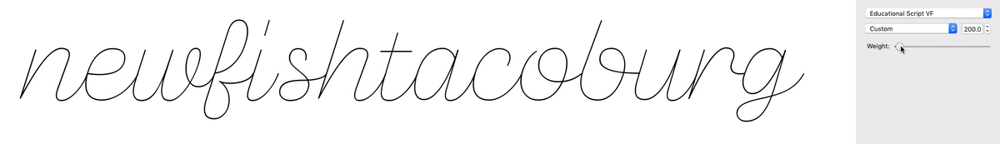
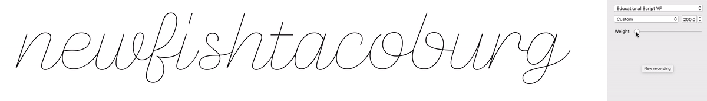
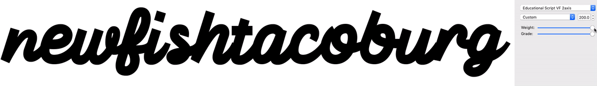

# Educational Cursive Font, First Draft

An exploration of cursive letterforms as a teaching tool, based on a conversation at https://groups.google.com/forum/#!topic/googlefonts-discuss/8lftImMKNtc.

With the advent of Variable Fonts, this might be an opportune time to add something brand new to the Google Fonts library – an educational font – and to use it to highlight some of the more exciting possibilities of variable fonts.

Obviously, this is just a very early-stage exploration of how this design problem might be approached from a drawing and production standpoint. Properly designing the family would be as much or more about researching the theories behind teaching beginners to write in cursive, plus making styles specific to different countries or regions. Additionally, it would require a fair amount of OpenType scripting to make a properly fluent script typeface. Some of this approach is described in [this GlyphsApp forum thread](https://www.google.com/url?q=https://forum.glyphsapp.com/t/making-an-educational-connected-script-font-opentype-help-and-glyph-setup/9799/14&sa=D&source=hangouts&ust=1540495655640000&usg=AFQjCNGs_dNSf9gLhnsK8QZ4Py2gdk5J0A), including reasons to avoid using ligatures for connected letters.

## Early tests

I drew in single-line, non-closed paths, making sure that the strokes always ended up at the same point, beyond the right side of the letter, and that the left-side of letters touched that point. I somewhat arbitrarily chose `x: -99, y: 264` as this coordinate. If I were to push this further, I would want to re-evaluate whether to end here or elsewhere, and also whether the exit angle would benefit from being more consistent.


### Starting with the GlyphsApp filters "Offset Curves" & "Round Corners"

GlyphsApp makes it very easy to start a monolinear font. You simply draw a single path, and you can then set an "OffsetCurves" filter, which will automatically apply on export. For rounded corners and path endings, you can also set a "Round Corners" filter.

This is described at https://glyphsapp.com/tutorials/monoline. The one thing I found is that "Copy Filter" didn't quite work as described ... the copied text was JSON, and had to be edited to the following format in order to work as a Custom Parameter:

```
OffsetCurve;25;25;1;0.5;
```

...where the `25;25;` describes the thickness.

I found that trying to "round corners" on a hairline-to-bold variable font was nearly impossible, because the point structures were so different with how the rounded terminals would be drawn onto thin and thick strokes. So, for now, I simply used the default Offset Curve, and worked with squared-off paths.

### Three masters vs two

In short: a three-master setup gives more control, but a two-master setup allows for smoother interpolation.

Here's a view of a three-master font. The first and second master share a center path, and can thus expand in place.



Here's the same font, but without the middle master. It provides a much smoother output, though it prevents the possibility of a monolinear font that could work at small-ish sizes.



It is possible that it's not quite an either-or choice. Instead of offering three masters on a weight axis, this could use Grade or Optical Size as a secondary axis. The font could scale from light to bold for weight, but could use a negative grade to move from the light to a hairline. That would mean three masters, but perhaps a smoother system of scaling. After all, the "hairline" style would be mostly for use at showing the font at a very large size, whereas a slightly-thicker version would likely be the better default style.



### That's all for now

As stated above, this was simply a quick exploration. Other work beckons, but if anyone finds this useful or would like to use it as a starting point for a new project, great! There's an OFL, so you are welcome to do what you like with the work.
