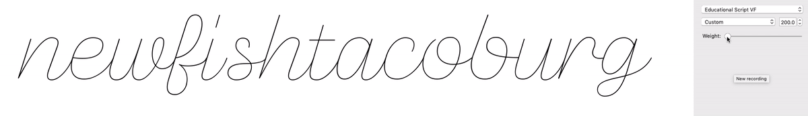

# Educational Cursive Font, First Draft

An exploration of cursive letterforms as a teaching tool, based on a conversation at https://groups.google.com/forum/#!topic/googlefonts-discuss/8lftImMKNtc.

With the advent of Variable Fonts, this might be an opportune time to add something brand new to the Google Fonts library – an educational font – and to use it to highlight some of the more exciting possibilities of variable fonts.

## Early tests

### Starting with the GlyphsApp filters "Offset Curves" & "Round Corners"

GlyphsApp makes it very easy to start a monolinear font. You simply draw a single path, and you can then set an "OffsetCurves" filter, which will automatically apply on export. For rounded corners and path endings, you can also set a "Round Corners" filter.

This is described at https://glyphsapp.com/tutorials/monoline. The one thing I found is that "Copy Filter" didn't quite work as described ... the copied text was JSON, and had to be edited to the following format in order to work as a Custom Parameter:

```
OffsetCurve;25;25;1;0.5;
```

...where the `25;25;` describes the thickness.

### Three masters vs two

In short: a three-master setup gives more control, but a two-master setup allows for smoother interpolation.

Here's a view of a three-master font. The first and second master share a center path, and can thus expand in place.


Here's the same font, but without the middle master. It provides a much smoother output, though it prevents the possibility of a monolinear font that could work at small-ish sizes.



It is possible that it's not quite an either-or choice. Instead of offering three masters on a weight axis, this could use Grade or Optical Size as a secondary axis. The font could scale from light to bold for weight, but could use a negative grade to move from the light to a hairline. That would mean three masters, but perhaps a smoother system of scaling. After all, the "hairline" style would be mostly for use at showing the font at a very large size, whereas a slightly-thicker version would likely be the better default style.


